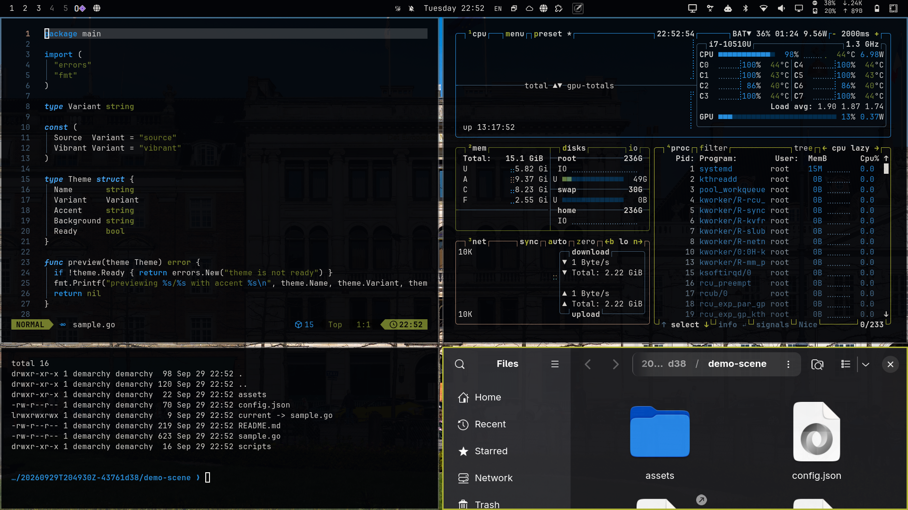
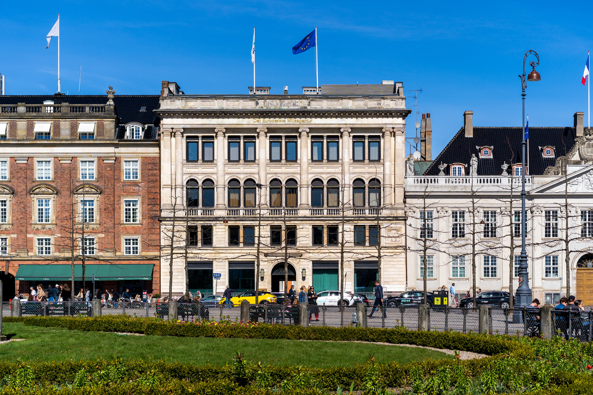
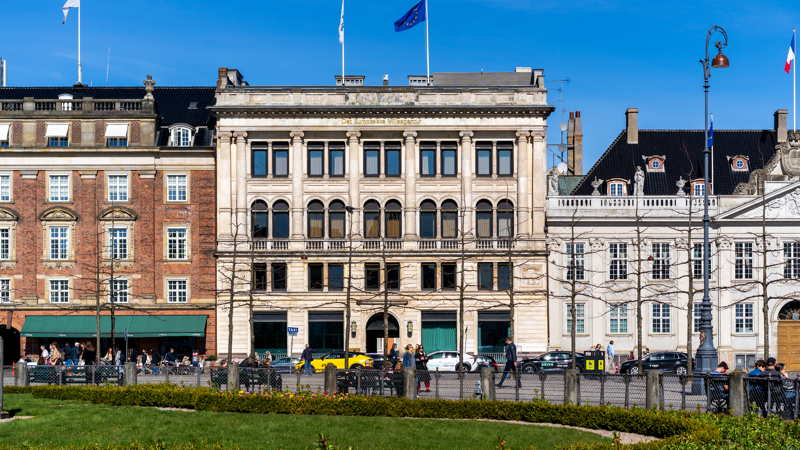

# EEA Building

An [Omarchy](https://omarchy.org/) theme inspired by the European Environment
Agency headquarters at night — near-black surfaces, deep blue selection, and a
warm olive accent picked out of the building's lighting.



| | |
| --- | --- |
|  |  |

## Install

Requires an Omarchy system. This installs the theme **and applies it
immediately**:

```sh
omarchy theme install https://github.com/demarant/eea-building
```

To switch back to your previous theme afterwards:

```sh
omarchy theme set <your-theme>
```

## What gets themed

- Hyprland — windows, borders, blur, animations
- Omarchy shell and bar
- Terminals — Alacritty, Foot, Ghostty, Kitty
- Neovim, Helix, VS Code, Obsidian
- btop, Chromium
- Lock screen and wallpaper
- Keyboard RGB
- Coding-agent UIs (Claude, PI, Hermes, T3)

## Palette

| Role | Color |
| --- | --- |
| Mode | dark |
| Accent | `#b2b632` |
| Selection | `#002847` |
| Background | `#030407` |
| Foreground | `#dad7d3` |

## Notes

- Generated with [Omagen](https://github.com/prettyletto/omagen) from a photo
  of the building; the generation recipe is kept in
  [`omagen.theme-recipe.json`](omagen.theme-recipe.json).
- Because the theme installs as a git clone, Omarchy regenerates the
  code-bearing files (`hyprland.lua`, `gum_env.lua`, `neovim.lua`, terminal
  configs) from `colors.toml` on your machine. To customize the palette, edit
  `colors.toml` in the local copy at
  `~/.config/omarchy/themes/eea-building/` and re-apply with
  `omarchy theme set eea-building`.
